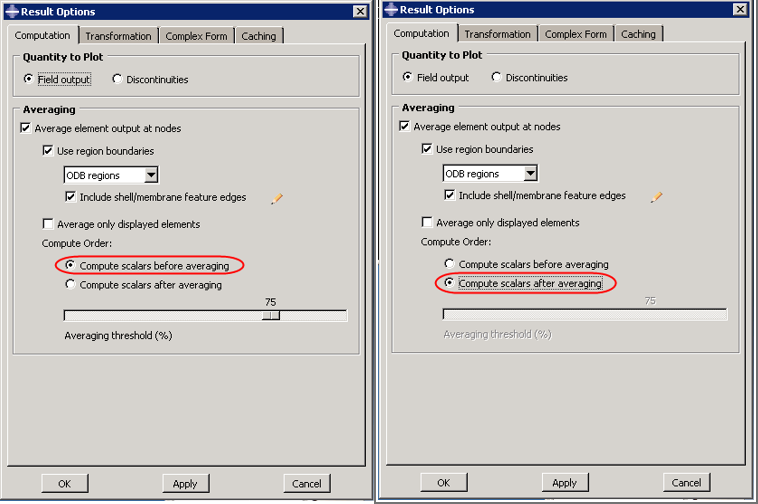
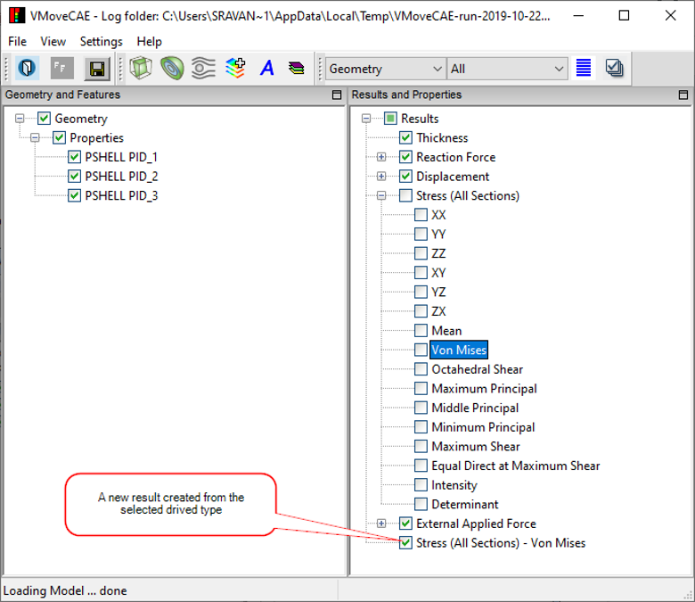

Matching Abaqus Result Values
=================================

**Nodal Averaging in Abaqus**

Stress results are available at integration points in the ODB files.  To help the user in visualising the model,  these stress values are interpolated to their nodal values.  The nodal values are then used to display the colors and the palette.

Users can control how this interpolation is performed in the Abaqus viewer.

  #. Start **Abaqus** viewer. 

  #. Go to **Result -> Options** to open the dialog box as shown below

  #. By default, **Compute scalars before averaging** option is selected.  For this option, the procedure to 
     compute the nodal values of "Von Mises Stress" is as follows:

      i. The stress component values are available at the integration points.

      ii. Von Mises stress values are computed from the stress components at the integration points.

             |Abaqus_Result_Values| 

      iii. Von Mises stress values at the element nodes are extrapolated from the Von Mises stress 
           values at the integration points.

      iv. Each node now has many values of Von Mises stress extrapolated from different elements. 
          Thes values are averaged as per the averaging threshold to get the final nodal values used in the 
          palette and color plot.

       If **"Compute scalars after averaging"** is selected,  the procedure to compute the nodal values of "Von 
       Mises Stress" is as follows:

      i. The stress component values are available at the integration points.

      ii. Element nodal values of each stress component are extrapolated from the stress component values at the integration points independently.

      iii. For each stress component, each node now has different values extrapolated from different elements.  These values are averaged to get final nodal values for every stress component.

      iv. Von Mises stress values are now computed from the stress component values at the nodes.

**Nodal Averaging in VMoveCAE & VCollab**

The minimum and maximum values in VCollab are expected to match with Abaqus if **"Compute scalars after averaging"** option is used in Abaqus viewer.  However, these values may not match with Abaqus viewer values if **"Compute scalars before averaging"** option is used.

VMoveCAE uses "Compute scalars after averaging" instead of "Compute scalars before averaging" to reduce file size and minimize performance overhead. 

**Reasons for Computing Scalars After Averaging in VMoveCAE**

  #. Visualization of ODB files using VCollab is a 2-step process.  In the first step, the ODB file is converted into a CAX file using VMoveCAE.  In the second step, users can visualize the CAX files using VCollab viewers.

  #. To reduce the file size, users can apply multiple filters in VMoveCAE.  Even when no filters are specified, VMoveCAE removes the volume from the solid elements and writes only the skin to the CAX file to reduce the file size.  As a result, all the data required for interpolation and averaging nodal values from integration point values is not available in CAX file, and VCollab Viewer cannot perform these operations accurately.  However when VMoveCAE has access to an ODB file, it can interpolate and average to compute the nodal values correctly.

  #. In the "Compute scalars after averaging" approach, the derived type computation comes as the last step.  All the interpolation and averaging operations are performed in VMoveCAE, and the nodal values for the six stress components are written into the CAX file.  The VCollab viewer can compute any derived type (Von Mises Stress, Principal Stresses, Maximum Shear etc) from these six stress components during the visualization.  So, the "compute scalars after averaging" is the natural mechanism in VMoveCAE and VCollab viewer due to the 2-step approach.

  #. In the "Compute scalars before averaging" approach, the derived type computation needs to be performed before interpolation and averaging operations.  This means the derived type computations need to be performed by VMoveCAE.  VMoveCAE has to interpolate and average to compute nodal values for all the required derived types and store them in the CAX file.  If the number of derived types are many, this will lead to large performance overhead and CAX file sizes.  Due to this reason, this option is not supported as of now.

**Workaround  for Computing Scalars Before Averaging in VMoveCAE**

As mentioned earlier, VMoveCAE needs to interpolate and average just 6 stress components in the "compute scalars after averaging" approach. Users can visualize several derived types in VCollab with this approach.  To provide the "compute scalars before averaging" option, VMoveCAE has to interpolate and average all the required derived types and write them to CAX.  This leads to performance overheads and large files sizes if the number of derived types required by the user is large.  

However, when only one or two derived types need to be visualized, "compute scalars before averaging" turns out to be beneficial. This is because only one or two derived types need to be computed and written into the CAX file instead of the six components. 

In this case  the user can export derived types by specifying them in the result name separated by a '-'. For example, suppose the user wants to visualise "Von Mises" stress and no other derived types (different stress components, principal values etc).  This can be visualised in both GUI and batch mode.

**VMoveCAE GUI**

  #. Start VMoveCAE and load an ODB file.

  #. Select the 'Stress' result.

  #. Click the **Expand** button. It expands and lists all derived scalar types

  #. Select 'Von Mises' derived type. This enables the **Create Result** icon in the toolbar.

  #. Click the **Create Result** icon. It appends the result list with the new result name 'Stress - Von Mises'.

                |Abaqus_Result_Value_CreateResult|

  #. Click Save CAX to translate into a CAX file.

**Batch Mode**

The command below will give the values matching with the "compute scalars before averaging" option for visualising "Von Mises" derived type. 

VMoveCAEBatch.exe **--results="Stress - Von Mises" bracket2.op2 bracket2.cax**

**Abaqus - VCMoveCAE**

===================================   ====================================  ============================
 **Abaqus Result Options**               **Collab Equivalent**                  **Remarks** 
===================================   ====================================  ============================
Compute Scalars Before Averaging       Create required derived type          VCollab matches with 100% 
                                       result in VMoveCAE                    threshold. It may differ for 
                                                                             some nodal values in threshold 
                                                                             percent less than 100.No 
                                                                             discontinuity is considered for 
                                                                             averaging.

Compute Scalars After Averaging         VMoveCAE Default.                    Scalars are computed in VCollab 
                                                                             Pro and Presenter.

                                       
===================================   ====================================  ============================

