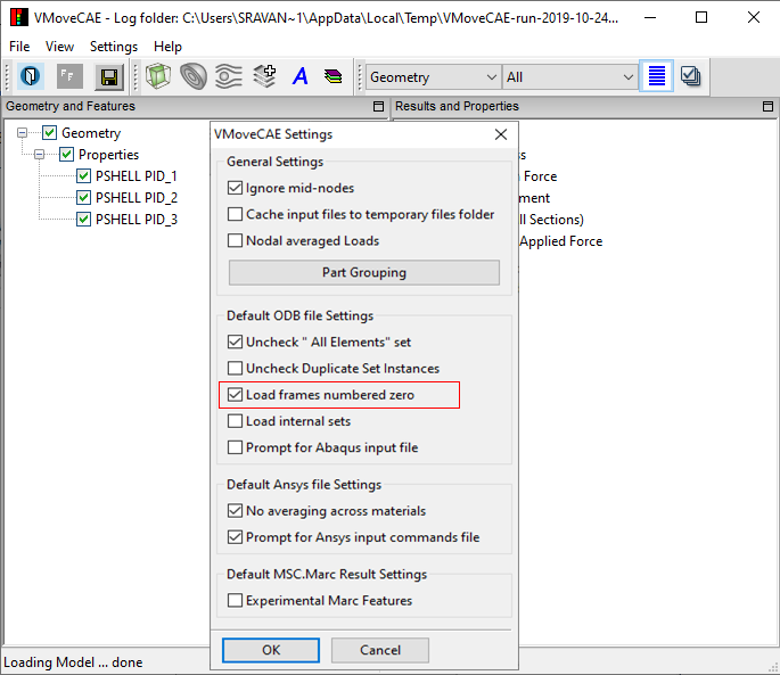

Translating Frame 0 corresponding to initial conditions from ODB files
===========================================================================

During the translation of ODB files, VMoveCAE ignores the frames corresponding to the initial conditions (frame 0) by default. This module shows how users can change the settings to include frames numbered zero in both batch mode and through GUI. 

**VMoveCAE GUI**

  #. Start **VMoveCAE** and load a CAE file. 
  
  #. Go to **Settings->Preferences** to open the Preferences dialog box. Check **Load frames numbered zero** checkbox.
  
       |Translating_frames| 

  
  #. Click on the Save **CAX** icon to save the file. The output CAX file will contain initial conditions frames as desired. 

**Batch Mode**

The reading and translation of frames corresponding to initial conditions can be enabled in batch mode using the command line option **“--enable-odb-load-zero-frames”**. 

  

    
