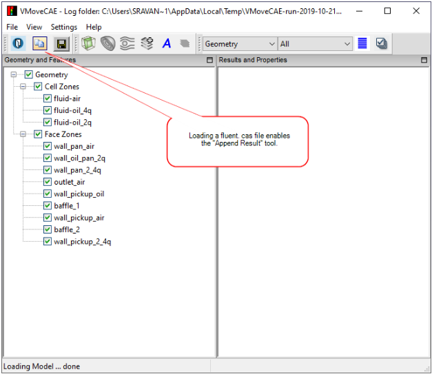
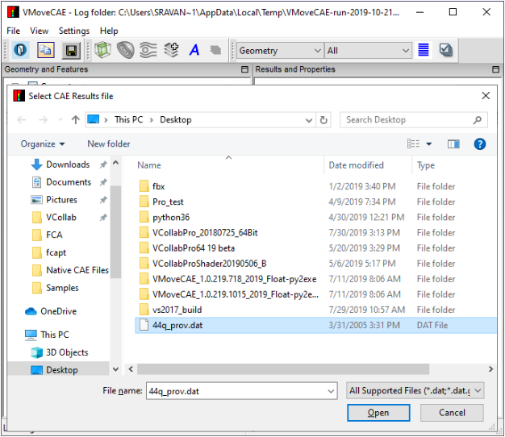
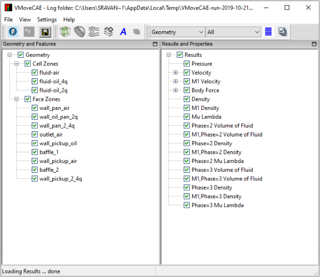

Appending Results File
======================

Simulation data is stored in the form of model and result files in any CAE software. For example, Fluent creates .cas and .dat files. The .cas file consists of the mesh, boundary conditions and initial conditions where as the .dat file contains the simulation results. For such files, VMoveCAE supports appending results from the result file (.dat in Fluent) to the mesh in the corresponding model file (.cas in Fluent). This feature is available only for certain file types. **Append Results** icon is enabled only for file types for which appending results feature is supported.

==============================================   ====================================
 Model File Extension                              Appending Result Types
==============================================   ====================================
 Abaqus odb files (\*.odb)                       ADACS t_fat output files (*.tout,*.tout.gz,*.tout.bz2)
 Abaqus inp files (\*.inp)                       Hypermesh ASL Generic ASCII Files (\*.cp_hmasl, 
                                                 \*.cp_hmasl.gz,\*.cp_hmasl.bz2) 
                                                  
                                                 FESAFE Results Files (\*.fer, \*.fer.gz, \*.fer.bz2)

                                                 CSV Node Result Files (*.csv,*.csvn, *.csv.gz, *.csvn.gz, 
                                                 *.csv.bz2 ,*.csvn.bz2)

                                                 CSV Element Result Files (\*.csve , \*.csve.gz , \*.csve.bz2)

                                                 ADACS t_fat output files (*.tout,*.tout.gz,*.tout.bz2)

Nastran Bulk Data files (\*.bdf)                 SDRC Universal Files (*.unv, *.unv.gz,*.unv.bz2)

                                                 Nastran Output Files (\*.op2, \*.op2.gz, \*.op2.bz2)

                                                 Nastran XDB Files (\*.xdb, \*.xdb.gz, \*.xdb.bz2)

                                                 CSV Node Result Files (*.csv,*.csvn, *.csv.gz, *.csvn.gz, 
                                                 *.csv.bz2 ,*.csvn.bz2)
                                                 
                                                 CSV Element Result Files (\*.csve , \*.csve.gz , \*.csve.bz2)

                                                 ADACS t_fat output files (*.tout,*.tout.gz,*.tout.bz2)

Fluent CAS files (\*.cas)                        Fluent Data Files (\*.dat, \*dat.gz, \*.dat.bz2)
==============================================   ====================================     

The following steps describe how to append results in VMoveCAE for a .cas file.

#. Start VMoveCAE and load a Fluent .cas file

   For a .cas file, only the parts are displayed since results are not available in this file type. The **Append Results** icon is enabled and indicates that results can be appended from the corresponding .dat file.

    |Load Fluent cas file|

#. Click on **Append Results** icon. To append results from the .dat file, click on the **Append Results** |Append Result Icon| icon. This will open a file open browser. Select the corresponding .dat file and load it.
           
    |append-dat-browser|

#. VMoveCAE displays the appended results

 VMoveCAE displays the appended results as shown in the image below. 

    |append-dat-results|

  These parts and results will be translated to a CAX file when saved.

     

                                                                               