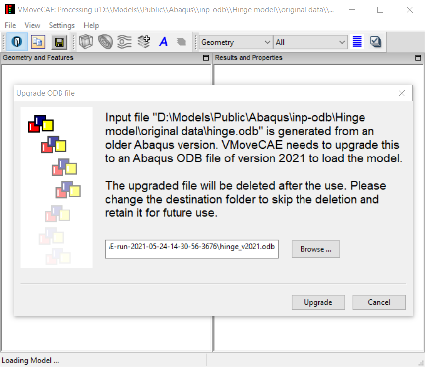
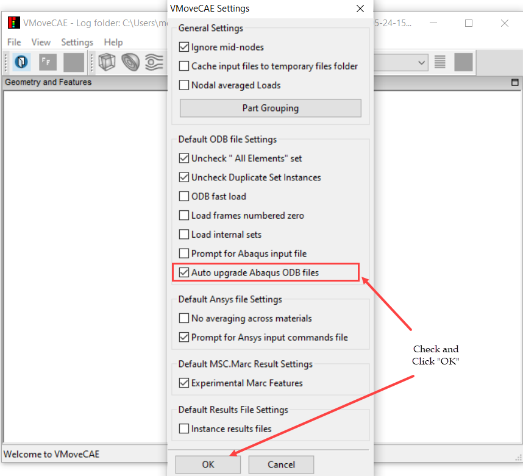

Auto Upgrade Abaqus ODB files
=============================

When a user selects an ODB file that belongs to an Abaqus version older than
what VMoveCAE supports, VMoveCAE is forced to upgrade and create a new file
that corresponds to the supported version. VMoveCAE can then load the upgraded
ODB file to identify and display the parts, results and instances and to
translate and generate a CAX file.

This upgrade procedure differs in VMoveCAE
GUI and batch modes. In batch mode, VMoveCAE automatically upgrades the
spcified ODB solution and creates the ODB file corresponding to the supported
version into a temporary folder. In GUI mode, VMoveCAE opens a wizard
prompting user to choose between upgrading the ODB file and going ahead with
the loading or skipping the upgradation and stopping the loading as shown
below.

               |Odb_upgrade_wizard|

By default, the upgraded file path is set to a temporary folder created by
VMoveCAE. The upgraded file is deleted after the termination of VMoveCAE
session. In the case that user wants to retain the file, he/she can do so by
changing the folder of the upgraded file path.

It is also possible to skip showing the wizard and upgrade the file
automatically. This can be done by enabling the auto upgrade option as
described below.

   #. Start **VMoveCAE**.
  
   #. Go to **Settings->Preferences** to open the Preferences dialog box.
      Check **Auto upgrade Abaqus ODB files** checkbox. 
  
        |ODB_auto_upgrade|

   #. Click on the "**OK**" button to update the setting.

