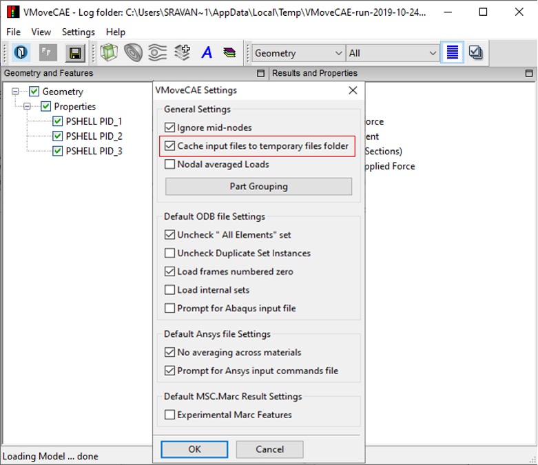

Caching Remote Input Files to Local Directory
=============================================

Large input files located in remote drives can be cached to a local folder to speed up loading and translation in VMoveCAE. This can be done by setting VCOLLAB_TEMP_PATH environment variable appropriately through VMoveCAE GUI or batch mode.

**VMoveCAE GUI**

   #. Start **VMoveCAE** and load a remote CAE file.
  
   #. Open the **Preference** dialog box (Settings->Preferences) and check **"Cache input files to temporary files folder"** option. 

   #. Click on the Save **CAX** icon to save the file. 

    |local_Caching_of_Input_Files|

**Batch Mode**

The caching of files to temporary file folder can be enabled in batch mode using the **“--enable-input-files-caching”** command line option. 

  

    
