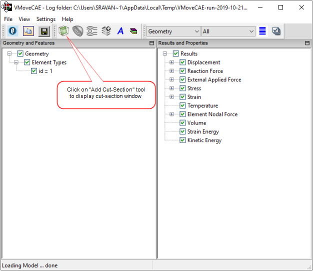
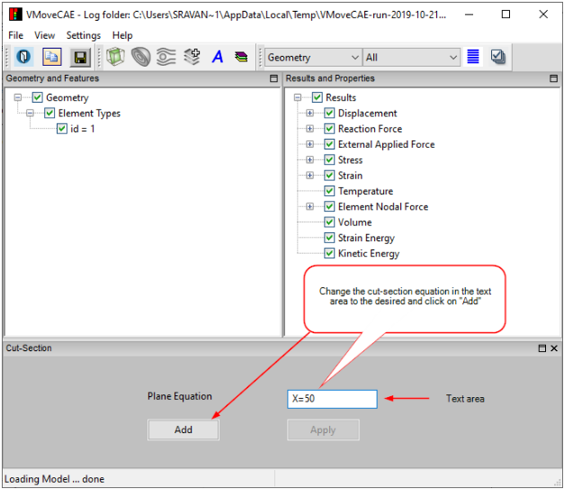
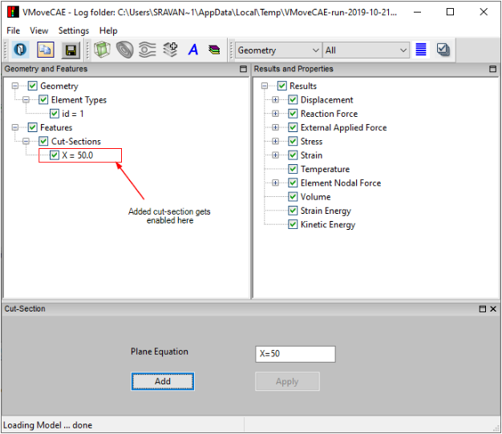
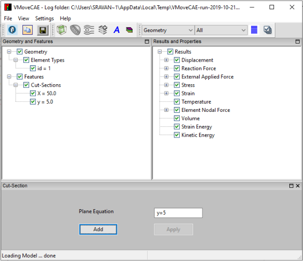
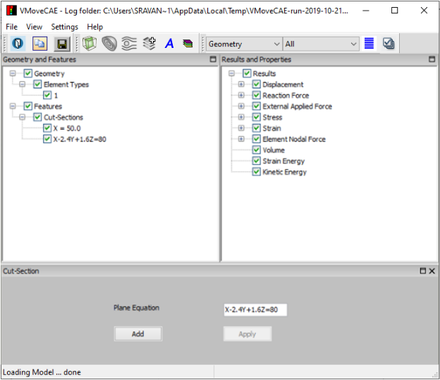

Creating and Editing Cut-Section
=================================

VMoveCAE provides the ability to create cut-sections. 

This module details the steps for creating cut-sections.  

#. Load the CAE file 

   In this example beam.rst file provided in the samples directory is used.  

#. Click on the **Add Cut-Section** icon to create cut-sections.

   |Click Cut-Section|

   This brings up the cut-section window. 

#. **Add a cut-section:** A cut-section can be added by entering an equation and clicking **Add**. The cut-section equation need to be in the form of “AX+BY+CZ=D”. 

   In this example we have entered “X=50”.

   |Adding Cut-Section|

   The new item gets added to the Cut-Sections tree under found under Features.. 

   |Added Cut-Section|

#. More cut-sections can be added in a similar way. For example, another cut-section with “Y=5” can be added. 
 
   |Added second cut-section|

   An existing cut-section can be changed by changing its Plane Equation. 

   Select the cut-section “Y=5” and change the value to “X-2.4Y+1.6Z=80”.

   |Changed the second cut-section value|

#. Proceed to translate to CAX file by clicking on Save CAX icon. The output CAX file can be opened in VCollab Professional or VCollab Presenter to  visualize the file cut-sections. If any cut-section is out of bounds and not cutting the geometry then VMoveCAE ignores it and the cut-section will not be created. 

#. **Generation of multiple parallel cut-sections**

  Multiple parallel cut-sections can be specified and created in one go with VMoveCAE. For this,  specify a range and number of cut-sections on the right side of the expression instead of a value. If no limit is specified by the user, VMoveCAE automatically computes the domain boundaries and uses them as limits.

   Examples:
       
     #. A plane equation of "**Y = 0:10:5**" results in the generation five cut-sections for "Y=1", "Y=3", "Y=5", "Y=7" and "Y=9". Zero represents the lower limit, ten represents the higher limit and the five represents the number of cut-sections.

     #. A plane equation of "**Y = :: 5**" creates five equally spaced cut-sections along the Y-axis. 
 
     #. The user can also specify only one of the limits, letting VMoveCAE compute and use the domain limit for the other limit. For example,  "**Y=:10:5**"  uses the domain minimum of the Y-coordinate value as the lower limit.
  

