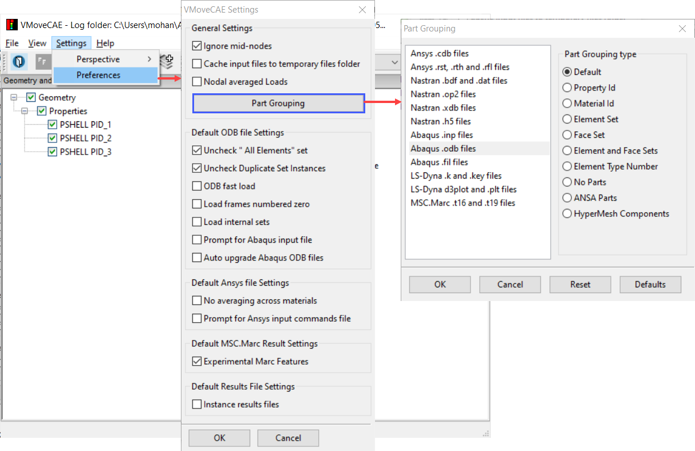

Element Grouping and Parts
=============================================

**Parts Classification in VMoveCAE**

In VMoveCAE, the basis for parts classification is different for different file formats.  The following table lists the various file formats and their corresponding parts classification.

==============================================   ====================================
 **File Format**                                   **Part Classifier**
==============================================   ====================================
 LS-Dyna input decks and binary result data      Material identifier
 ANSYS solution files                            Element type number
 ABAQUS input decks and results                  Element set name
 MSC.NASTRAN input decks and results files       Property Identifier
 MSC.MARC results                                Element sets and contact sets
 Fluent mesh and case files                      Zone identifier
 StarCCM+ results                                Region identifier

==============================================   ====================================

**Changing the Element Grouping**

  Users can change the element grouping and part generation through GUI or in batch mode.  

**VMoveCAE GUI**

   #. Start **VMoveCAE** and load a CAE file.
  
   #. Go to **Settings->Preferences** to open the Preferences dialog box. 

   #. Click on **Part Grouping**. Select the **Part Grouping Type** for all the required interfaces and click “OK” to save these preferences to VMoveCAE GUI configuration file.  

    |element_Grouping_and_Parts|

**Note:** Clicking on **Reset** clears the interface changes made in that session. Clicking on **Defaults** resets the part grouping to VMoveCAE default for all the interfaces.

**Batch Mode**

Users can specify the element grouping mechanism for generating parts using the ``--part-grouping`` command line option. The supported grouping types are listed below.  

============================= ====================================
 **Element Group Identifier** **Description**
============================= ====================================
 default                      Use default part generation mechanism
                              for the specified interface
 property-id                  Use property id (sections for ODB files)
                              to group elements into parts
 material-id                  Use material id to group elements into
                              parts
 element-set                  Create element sets as parts

 face-set                     Create face sets as parts

 element-and-face-sets        Create both element and face sets as 
                              face sets as parts
 element-type-number          Use element type and number to group
                              elements into parts
 element-type-and-components  Use element type and components
                              to group
 no-parts                     Translate the whole mesh as one part

 ansa-parts                   Extract ANSA part speicifcation from
                              comments (Supported only for BDF files)
 hypermesh-components         Extract Hypermesh component speicifcation
                              from comments (Supported only for BDF files)
 ansys-bodies                 Grouping based on ansys parts                              
============================= ====================================

For example, to create parts based on **property-id** element group, use the following command.

.. code-block:: bash

       VMoveCAEBatch.exe --part-grouping="property-id" hinge.odb hinge.cax

Similar commands can be used for other element group types (material-id, element-set, etc) to generate parts.

  

    
