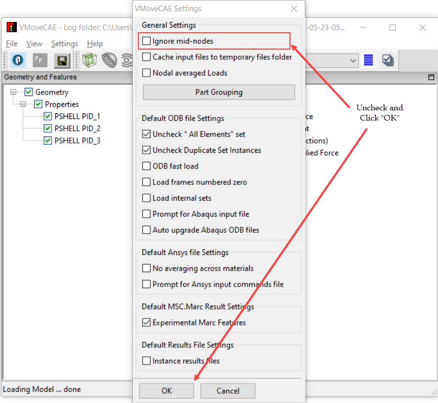

Enabling Mid-nodes for Translation
==================================

During translation to CAX files, VMoveCAE writes only the corner nodes values by default. The mid-nodes in higher order elements are not considered. This module shows how users can change the default setting to retain the mid-nodes in VMoveCAE GUI or batch mode. 

**VMoveCAE GUI**

   #. Start **VMoveCAE** and load a CAE file with mid-nodes.
  
   #. Go to **Settings->Preferences** to open the Preferences dialog box.
      Uncheck **Ignore mid-nodes** checkbox. 
  
        |Controlling_Mid_node|

   #. Click on the "**OK**" button to update the setting. The later translations
      will contain the mid-nodes in the CAX file where available.

**Batch Mode**

The translation of mid-nodes can be enabled in batch mode using the ``--enable-mid-nodes`` command line option.

.. code-block:: bash

       VMoveCAEBatch.exe --enable-mid-nodes hinge.odb hinge.cax

