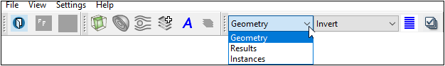
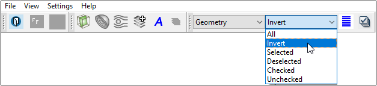
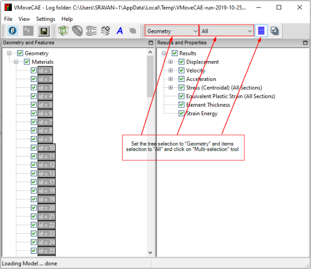
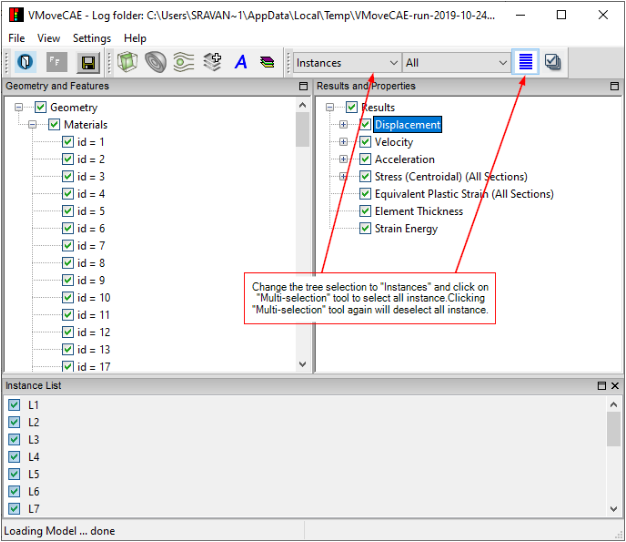
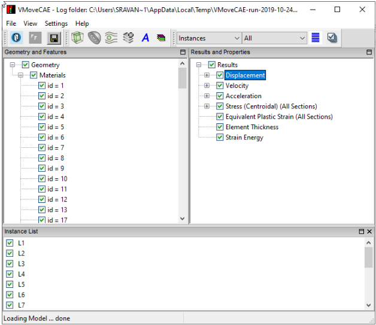
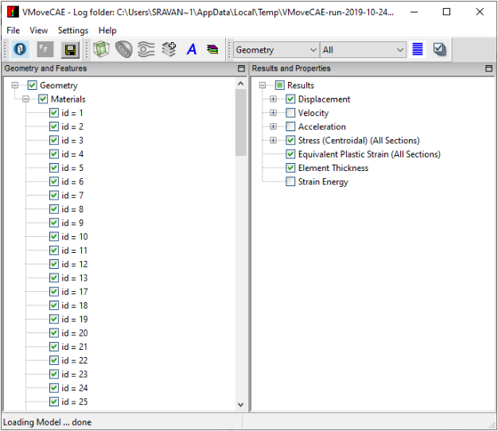
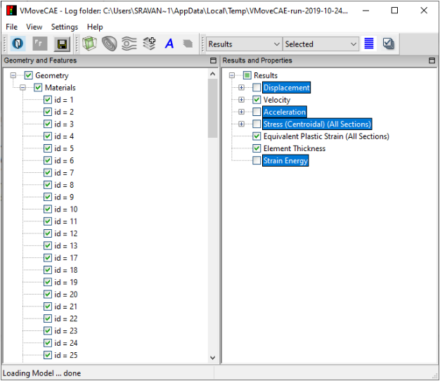

How to Filter Parts and Results?
===========================================
The selection toolbar in VMoveCAE provides several selection and filtering options for advanced users. These options allow users to select/deselect multiple items quickly.

The selection toolbar consists of the following controls and tools. 

- **Tree selection :** The tree selection tool lets you select the tree for which items need to be selected or deselected. The available options in this selection tool are : **Geometry, Results and Instances.** This is the first thing that needs to be selected.

    |Tress Selection Geometry|

- **Items selection:** Once the tree is selected, the items can be selected as: All , Invert, Selected, Deselected, Checked and Unchecked.

    |Item Selection| 

- **Multi-selection tool:** The multi-selection tool is a toggle switch which will select or deselect the items specified through Tree selection and Item selection.

- **Multi-check tool:** The multi-check tool is a toggle switch which will check or uncheck the items specified through Tree selection and Item selection.

These controls/tools are shown in the image.    

    |Tools for Multiple Item Selection and Checking|

**Selection Tool Examples**

The examples given below explain how these tools work.

**1. Select or Deselect All Parts**

To select all parts, set the tree choice to **"Geometry"** and item choice to **"All"** and click on "**Multi-selection"** tool.

   |Select All Parts|

This will select all the parts in the part list and changes the **"Multi-selection"** tool status as toggled as shown in the following diagram. Click on **"Multi-selection"** tool again to untoggle it and deselect all the parts.

**2. Select or Deselect All Instances**

Click on an individual Result - Displacement (in this example),  to enable the **"Instance List"** window. Set the tree choice to **"Instances"** and click on **"Multi-selection"** tool.

   |Select All Instances|

This action selects all the instances as shown in the following diagram. Clicking it again deselects all the instances.

   |Select All Inst|

**3. Invert Check Status**

Uncheck some results. In the following image, "**Velocity**", "**Acceleration**" and "**Strain Energy**" are unchecked.

   |Invert Check Status|

Now change the tree choice to **"Results"** and item choice to **"Inverted"** and click **"Check Multiple"** tool. This will invert the check status of all the results as shown in the following diagram.

**4. Checking or Unchecking Selected Items**

Select some results. In the following diagram, "**Displacement**", "**Acceleration**", "**Stress (Centroidal) (All Sections)** " and "**Strain Energy**" are selected. 

   |Check Result|

Now change the item choice to **"Selected"** and click on **"Check Multiple"** tool. The **"Check Multiple"** tool which is toggled earlier now changes its state to untoggled. The checked results ("Bottom Section Stress (Centroidal)" and "Stress and Moment Resultant") among the selected now gets unchecked. The check status of unchecked items among the selected as well as the deselected items remain unaltered.

   |Uncheck Result|

.. |Tools for Multiple Item Selection and Checking| image:: images/selectcheck-tool.png

