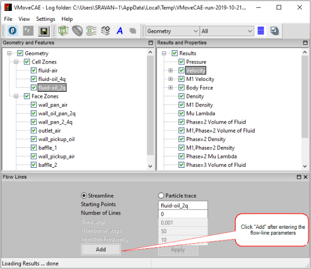

Creating and Editing Flow Lines
================================

VMoveCAE provides the ability to create streamlines and particle-trace. This support is limited to steady flows only. This module shows the steps for creating streamlines and particle-traces. 

#. Start **VMoveCAE** and load a CFD file.

#. Select  **Velocity** from the **Results and Properties** tree to enable the **Add Flow-Lines** icon from the toolbar.

#. Click on the **Add Flow-Lines** icon to open the Flow Lines window.

     |Velocity Selected|

     |Flow Lines Window|

#. Set the flow-line parameters and click **Add**. This adds a new flow-line in the “Features” tree in “Geometry and Features” window.

   Note: For **Starting Points**, users can either provide a single point, or select a part from the “Geometry and Features” tree. When a part is selected, VMoveCAE uses the centroids of the part's faces as flow-line starting points. Particle traces require additional inputs such as time-step, number of steps in the animation and injection frequency (Ex. injection frequency of 10 means particles are injected at the starting points every 10 steps).

     |Parameters Entered|

     |Flow-line Added|

#. Click on **Save CAX** icon to translate and create a CAX file. Open it in VCollab Pro or Presenter to visualize the added flow-line. For a better flow-line visualization, user can make the parts transparent. 

