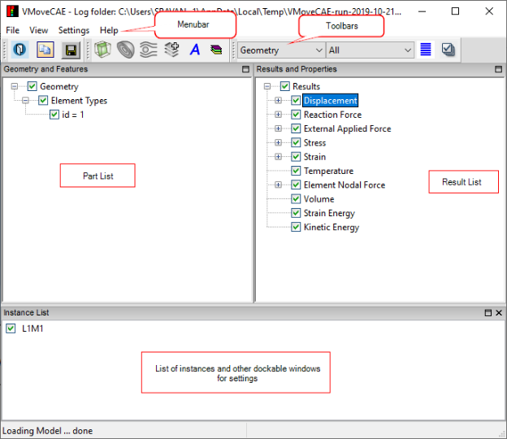

Graphical user interface(GUI)
=============================

**Graphical user interface(GUI)** is a form of user interface that allows users to interact with electronic devices through graphical icons and visual indicators.

The image below shows the GUI layout which is presented on the screen once VMoveCAE is started.

**What are the main components of VMoveCAE GUI**

The GUI of VMoveCAE has 5 main components.

-  **Menu Bar**: The Menu Bar lists the basic options like **File, View, Settings** and **Help.**
-  **ToolBar**: The frequently used tools needed to handle CAX translation are available in the toolbar. A user will be able to create CAX files completely using the toolbar items. 
-  **Geometry and Features Window**: The Geometry and Features window displays parts and features list in a tree structure. 
-  **Results and Properties Window**: The Results and Properties window displays the list of Results in a tree structure. 
-  **Dockable windows**:The user can choose any one of the following windows to dock 

   -  **Instance List**
   -  **Cut-Section Settings**
   -  **Iso-Surface Settings**
   -  **Flow-Line Settings**
   -  **Result Properties Settings**
   -  **Attributes Settings**