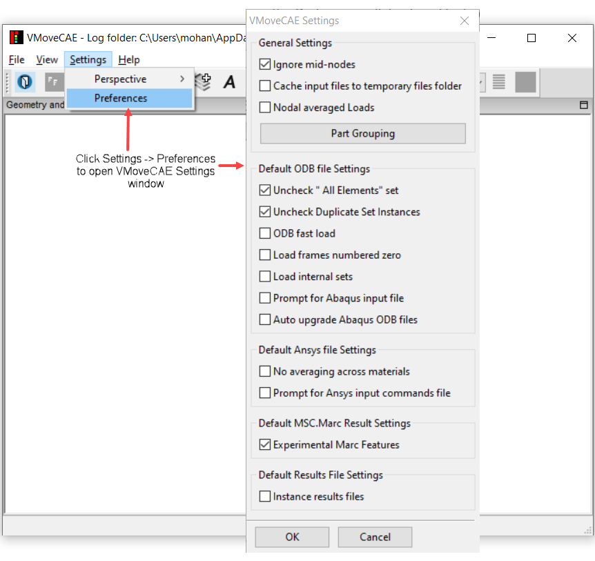
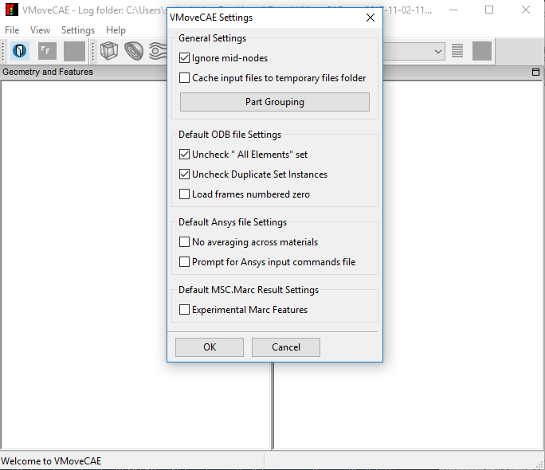

GUI Preferences
==================

In VMoveCAE, users can view and alter settings that govern the translation process. This module shows how to change the user preferences through Settings option found in the menu bar. 

#. Start **VMoveCAE** and load a CAE file.
 
#. Go to **Settings->Preferences** to open the **VMoveCAE Settings** dialog.

    |Settings-Preferences-Menu|

#. Alter the settings as desired and save them by clicking the **OK** button. The significance of these settings are described in the later sections. Please note that these preferences are saved into the VMoveCAE configuration file and applied in the subsequent VMoveCAE sessions. These changes are carried across multiple VMoveCAE sessions. 

