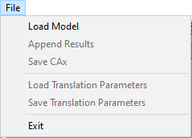
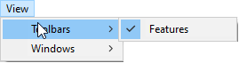
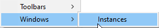
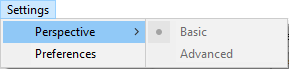
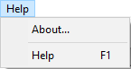

Menu Options in VMoveCAE
========================

The complete list of Menu options available in VMoveCAE is as follows:

**File Menu**

-  Load Model
-  Append Results
-  Save CAx
-  Load Configuration
-  Save Configuration
-  Exit

**View Menu**

- **Tool Bars**
  
  - **Features**

- **Windows**

  -  **Instances**

**Settings Menu**

- **Perspective**

  - **Basic**

  - **Advanced** 

- **Preferences**

**Help Menu**

-  **About**

-  **Help**

