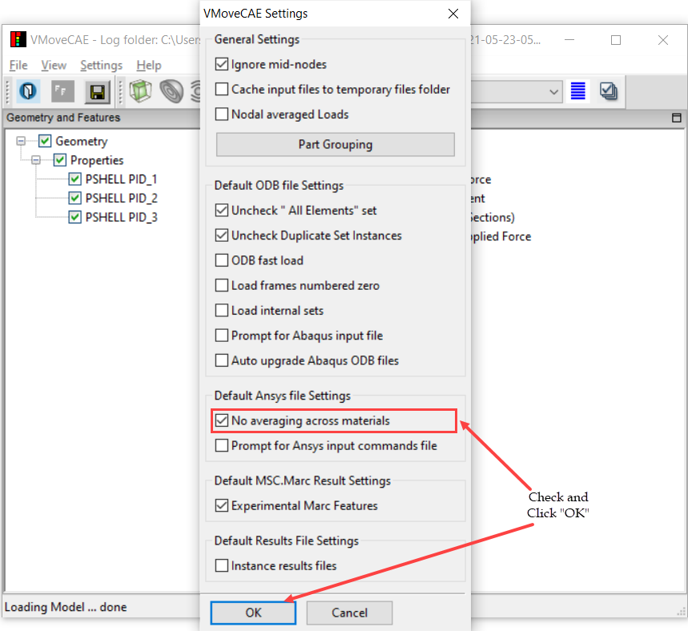

Nodal Averaging Options
===========================

To compute nodal values from element nodes, VMoveCAE uses the averaging technique as shown in the figure. 

.. figure:: images/Nodal_Averaging_Options.png
   :alt: Nodal averaging options
   :align: center

   Elemental nodal to nodal averaging process 

**Computing Nodal Averages from Elemental Node**

VMoveCAE follows the "average and derive" principle for computing the derived
values of vector, 6-DOF and tensor results. All the components are first
computed at the nodes by averaging the element nodal values. These average
nodal values are used to define the derived quantities.

**Disabling Nodal Averaging Across Materials** 

This option is valid for Ansys RST, RTH and Abaqus ODB files only.

During the nodal value computation, Ansys workbench/Abaqus Viewer only uses
the elements corresponding to the same material in the averaging process. This
results in different result values for different materials for each node at an
interface between materials.

Unlike Ansys workbench/Abaqus viewer, VMoveCAE considers the nodes across
materials by default while computing the nodal values from elemental or element
location values. This results in faster translation and smaller file sizes.
However, this also may result in the nodal average values and their ranges
that differ from Ansys workbench/Abaqus viewer.

Users can alter this default setting in VMoveCAE through the GUI or in batch
mode.

**VMoveCAE GUI**

  #. Start **VMoveCAE** and load an input file.

  #. Go to **Settings->Preferences** to open the Preferences dialog box. Check
     **No averaging across materials** as shown below. 

          |Nodal_Averaging_Options_GUI| 

As a result of this setting, VMoveCAE preserves the discontinuities of values
across the materials during the elemental to nodal and element nodal to nodal
averaging processes. 

**Batch Mode**

The command to disable nodal averaging across materials in batch mode is
``--no-averaging-across-materials``. The below example shows how to preserve
material discontinuities while reading the geometry and results from
**file.rst** and named components from **ds.dat** and translating them into
**file.cax**. 

.. code-block:: bash

       VMoveCAEBatch.exe --ansys-input-commands="ds.dat" --no-averaging-across-materials file.rst file.cax 

  

