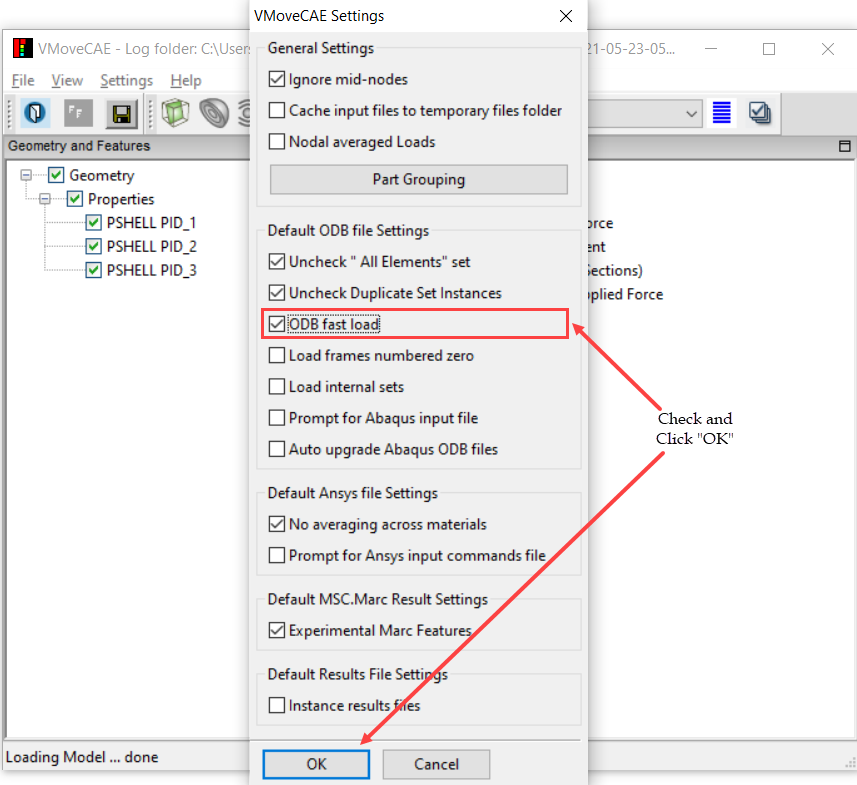

Enabling Fast Loading of ODB files
==================================

During the loading of an ODB file, VMoveCAE uses ODB API to get the list of
results available per each step and frame. This operation in ODB API involves
extensive file I/O and is highly time consuming especially if the solution
involves a large number of frames. VMoveCAE provides a user setting that
reduces the ODB file loading time in cases where the number of frames is very
high. When this option is enabled, VMoveCAE assumes that each frame of a given
step in the ODB solution contains the same list of results and the list of
results that are read for the first frame is used as the list of results for
other frames as well. For ODB files that involve different result lists for
different frames, this might provide wrong list of result lists and should not
be used.

**VMoveCAE GUI**

   #. Start **VMoveCAE**.
  
   #. Go to **Settings->Preferences** to open the Preferences dialog box.
      Check **ODB fast load** checkbox. 
  
        |ODB_Fast_Load|

   #. Click on the "**OK**" button to update the setting.

**Batch Mode**

The fast loading of ODB files can be enabled in batch mode using the
``--enable-odb-fast-load`` command line option.

.. code-block:: bash

       VMoveCAEBatch.exe --enable-odb-fast-load hinge.odb hinge.cax

  

