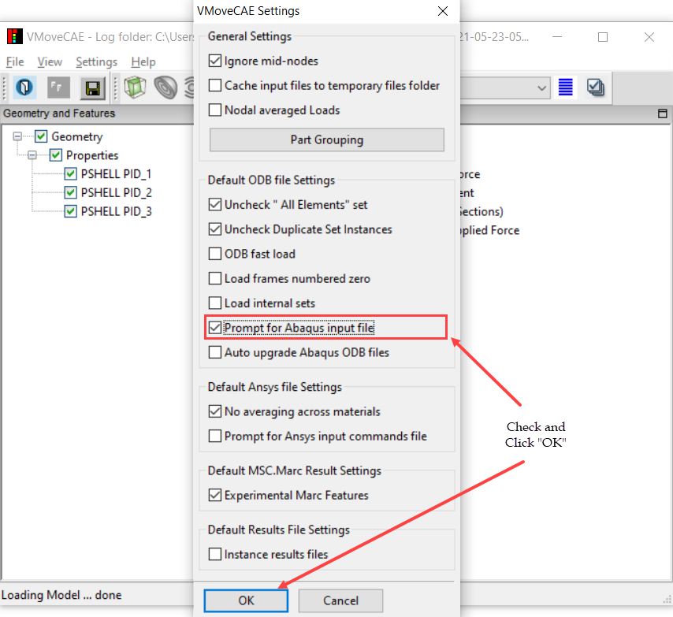
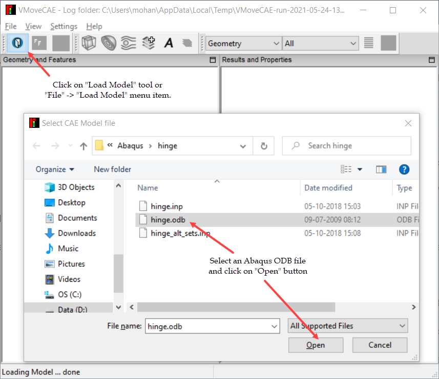
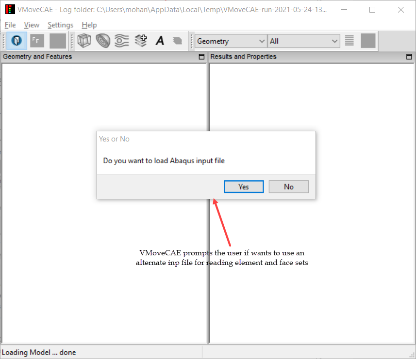
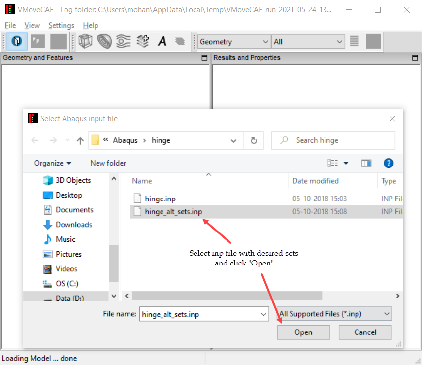
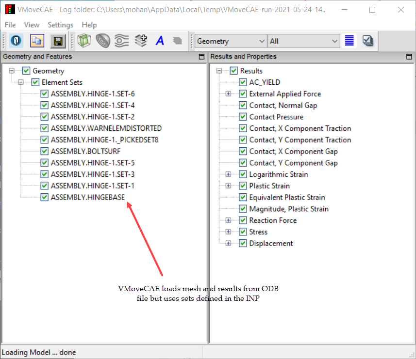

Element and Face Sets from Abaqus Input Files
=============================================

VMoveCAE allows users to read element and face sets from compatible Abaqus INP
files and use them as parts while translating the ODB files. This
functionality is available through GUI as well as in batch mode. The mesh and
element ids in both the INP and ODB files are expected to be the same. 

**VMoveCAE GUI**

  #. Start **VMoveCAE**.
  #. Go to **Settings->Preferences ->** Check **Prompt for Abaqus input file**
     in the Preferences dialog box. 

               |Enable_sets_from_Abaqus_inp|

  #. Click on the "**OK**" button to update the setting.
  #. Click on the **Load Model** icon to load an Abaqus solution file (.odb). 

               |Abaqus_load_model|

  #. VMoveCAE prompts for the Abaqus input file (.inp). Click **Yes** to
     select an Abaqus input file.

               |Abaqus_inp_prompt|

  #. Select the required Abaqus input file (.inp).

               |Abaqus_inp_sets_select| 

  #. This will load the element and face sets from the Abaqus inp file and 
     uses them with the geometry and results defined in the Abaqus results file 
     as shown in the image.

               |Abaqus_inp_sets_odb_geomres| 

Note: Clicking **No** during the prompting leads to loading of only the
geometry and results from the Abaqus results file. 

**Batch mode**

To read and translate element and face sets from Abaqus INP file in batch mode,
users need to specify the location of INP file using ``--abaqus-input-file``
option. The example below reads geometry and results from hinge.odb,
element and face sets from hinge_alt_sets.inp, translates and saves the output
to hinge.cax. 

.. code-block:: bash

         VMoveCAEBatch.exe --abaqus-input-file="hinge_alt_sets.inp" hinge.odb hinge.cax

