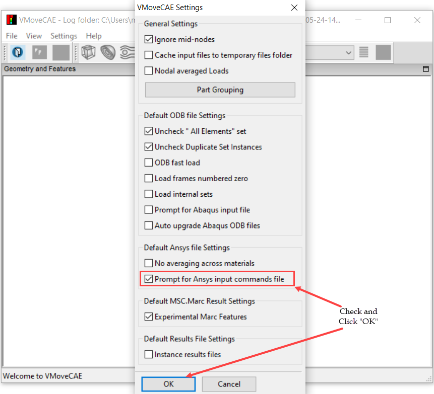
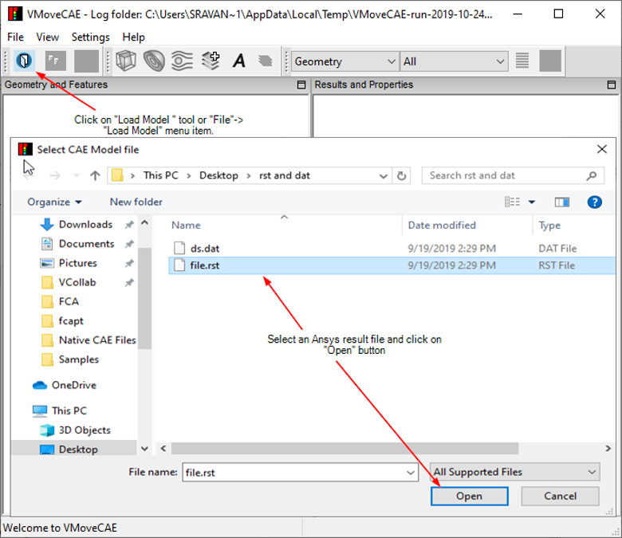
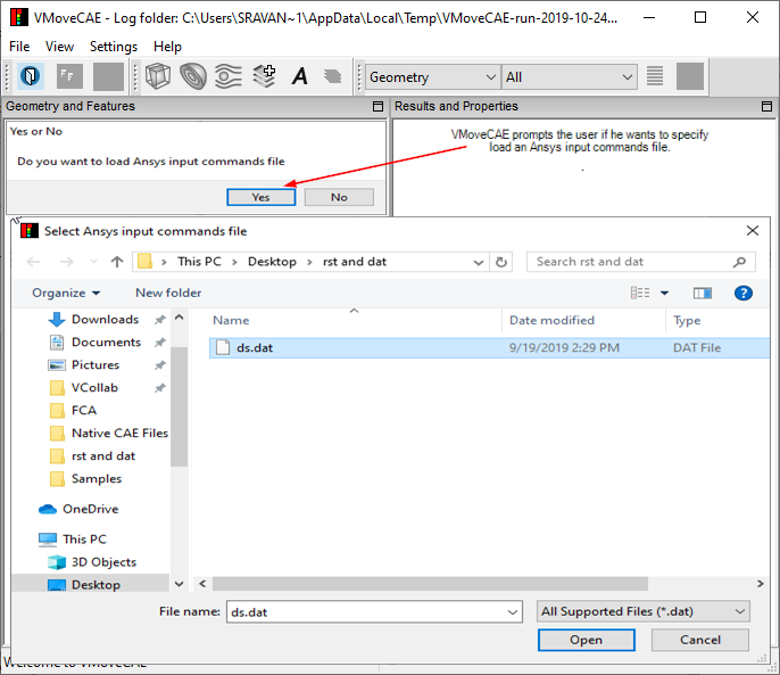

Reading Ansys Named Selections in VMoveCAE
============================================

VMoveCAE users can read named selections from Ansys input files (ds.dat) while loading them. Users can read the Ansys input file either through GUI or in  batch mode.

The current version reads only the element components from the Ansys input file.

**VMoveCAE GUI**

  #. Start **VMoveCAE**.
  
  #. Go to **Settings->Preferences ->** Check **Prompt for Ansys input commands file** in the Preferences 
     dialog box. 

               |Ansys_Named_Components_GUI|

  #. Click on the **Load Model** icon to load an Ansys result file (.rst). 

               |Ansys_Named_Components_LoadModel|

  #. VMoveCAE prompts for the Ansys input commands file (ds.dat). Click **Yes**, to select the Ansys input 
     commands file.

               |Ansys_Named_Components_Prompts|

  #. Select the corresponding Ansys input commands file (ds.dat).

  #. This will load the named element selections along with the geometry and results from Ansys results file 
     into VMoveCAE as shown in the image.

               |Ansys_Named_Components_GeometryandResults| 

Note: Clicking **No** during the prompting leads to loading of only the geometry and results from the Ansys results file. 

**Batch mode**

To read and translate Ansys named selections in batch mode, users need to specify the location of ds.dat file using “--ansys-input-commands” option. The example below reads geometry and results from file.rst, named components from ds.dat, translates and saves the output to file.cax. 

         VMoveCAEBatch.exe **--ansys-input-commands="ds.dat" file.rst file.cax** 

Please note that, both the absolute and relative paths can be used while specifying the file paths. When no ansys input commands file is specified, VMoveCAEBatch creates the parts in the CAX file based on the element type number only. 

        VMoveCAEBatch.exe **file.rst file.cax**

**VMoveCAE Limitations in Reading the Named Components**

      #. Only element components are supported in this version. Node components are ignored while readingthe 
         Ansys input commands file.  

      #. In the ESEL definitions, only the following selection types are supported in VMoveCAE. Other 
         definitions are ignored. 
 
           -	**s** - select a new set 
           -	**a** - Add to the existing set 
           -	**none** - Unselect the full set 
           -	**all** - Restore the full set 

      #. In the ESEL definitions, only the following component labels are supported by VMoveCAE. Other 
         definitions are ignored. 

                - **type** - Element type number 
                - **mat** - Material number 

.. |Ansys_Named_Components_GeometryandResults| image:: images /Appending_Ansys_Named_Components_GeometryandResults.png

  

    
         