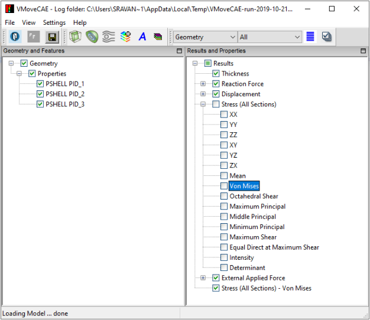

Creating Results from Derived Types
=====================================

During the translation process, VMoveCAE computes the nodal averages for elemental and element nodal results by default. The nodal averages are also computed for vector, 6-DOF and tensor results. VCollab viewers use these components to compute various derived types for visualization, probing and listing values.

The user can choose to export only a certain set of derived types instead of all the components. This helps in reducing the CAX file size and also allows users to compute the derived quantities before averaging and computing the nodal values. 

This module describes the procedure for creating derived types into new results using the **Create Result** |Create Result| functionality.

#. Start **VMoveCAE** and load a CAE file.

#. Click on the expand sign next to a vector/6-dof/tensor result. This expands the tree and displays the derived types of the result.

#. Select the required derived type that needs to be computed and written to the file. This enables the  **Create Result** |Create Result| icon in the toolbar.

   In this example, Von Mises Stress found under Stress(All Sections) has been selected . 

      |Select DerivedType|

#. Click on the **Create Result** icon |Create Result|. A new result is created in the results list.

       |Created Result DerivedType| 

#. . Click on **Save CAX** icon to translate and create the desired CAX file.

