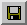
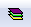
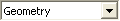
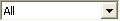

VMoveCAE Tools
==============

================================  ==================================          ===========================================================================================================================================================
Name                              Icon                                         Description
================================  ==================================          ===========================================================================================================================================================
Load Model                        |Load Model Tool|                           This tool opens a file browser from where you can browse, select and load a native CAE model file.
Append Results                    |Append Results Tool|                       This tool opens a file browser from where you can browse, select and append a native CAE results file.
Save CAx                          |Save CAx Tool|                             **Save CAX** option opens a Save File dialog box where you can specify the location and the name of the CAX file you are saving.
Toggle Cut-Section Window         |Toggle Cut-Section Window Tool|            **Toggle Cut-Section Window** option opens the Cut-Section pane which can be used for creating and modifying cut-sections.
Toggle Iso-Surface Window         |Toggle Iso-Surface Window Tool|            **Toggle ISO-Surface Window** option opens the ISO-Surface pane which can be used for creating and modifying iso-surfaces.
Toggle Flow-Lines Window          |Toggle Flow-Line Window Tool|              **Toggle Flow-Lines Window** option opens the Flow-Lines pane which can be used for creating and modifying flow-lines.
Create Result                     |Create Results Tool|                       The **Create Result** tool creates selected derived type.
Add/Edit Attributes               |Add/Edit Attributes|                       The **Add/Edit Attribute** option lets you add and edit additional user specified attributes for the CAX file.E.g. Add/Edit Attributes="Arial" size="2"
Section/Layer Aggregates          |Result Properties|                         The Section/Layer Aggregates lets you specify the aggregates that need to be computed when multiple sections or layers are present.
Tree                              |Select-Check Tree|                         This drop down option lets you identify the tree for which select/check operation needs to be carried out
Items                             |Select-Check Items|                        This drop down option lets you identify items for which select/check operations to be performed.
Select Items                      |Select Items Tool|                         The **Select Items** option lets you Select/Deselect individual items from the chosen tree 
Check Items                       |Check Items Tool|                          The **Check Items option** lets you Check/Uncheck individual items from the chosen tree
================================  ==================================          ===========================================================================================================================================================

.. |Toggle Cut-Section Window Tool| image:: images/cut-section.png

.. |Toggle Flow-Line Window Tool| image:: images/flow-lines.png
.. |Create Results Tool| image:: images/create-results.png

