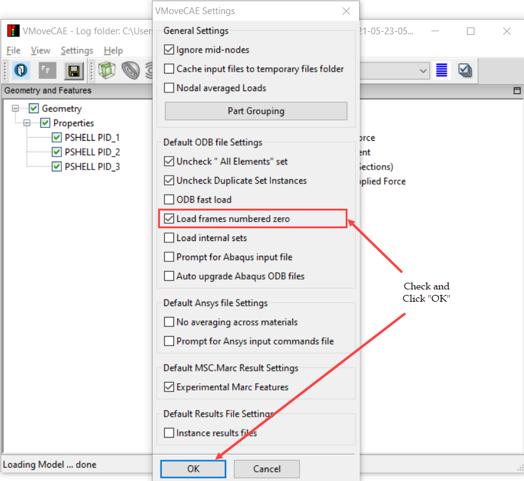

Translating initial conditions from ODB files
=============================================

During the translation of ODB files, VMoveCAE ignores the frames corresponding
to the initial conditions (frame 0) by default. Many times, users are not
interested in exporting these results into the CAX file. Ignoring these frames
result in reduced ODB loading times and smaller CAX files.

VMoveCAE provides an option to the user to enable the loading of these frames
if the user desires so. This module shows how users can change the settings to
include frames numbered zero in both batch mode and through GUI. 

**VMoveCAE GUI**

  #. Start **VMoveCAE**.
  
  #. Go to **Settings->Preferences** to open the Preferences dialog box.
     Check **Load frames numbered zero** checkbox.
  
       |Translating_zero_frames| 

  
   #. Click on the "**OK**" button to update the setting.

**Batch Mode**

The reading and translation of frames corresponding to initial conditions can
be enabled in batch mode using the command line option
``--enable-odb-load-zero-frames``. 

.. code-block:: bash

       VMoveCAEBatch.exe --enable-odb-load-zero-frames hinge.odb hinge.cax

  

    
